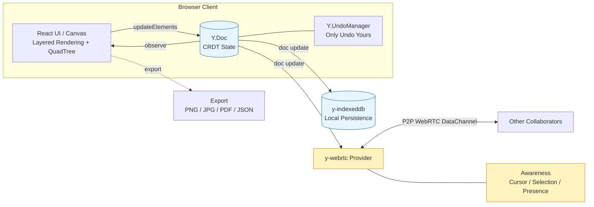

<div align="center">
  <h1 align="center">mini-excalidraw</h1>
  <p align="center">
    <strong>Local-first · CRDT-native Collaborative Whiteboard</strong>
  </p>
  <p align="center">
    A hand-rolled, stripped-down Excalidraw, built from scratch.
    <br />
    One Canvas, one <code>Y.Doc</code>, and a single spine that runs from&nbsp;layered rendering&nbsp;→&nbsp;spatial indexing&nbsp;→&nbsp;local persistence&nbsp;→&nbsp;real-time collaboration.
    <br />
    Six weeks of iteration — each week a self-contained technical deep dive.
  </p>
</div>

<p align="center">
  <a href="https://github.com/ZhechenZ/mini-excalidraw/actions/workflows/ci.yml"></a>
  <a href="https://github.com/ZhechenZ/mini-excalidraw/actions/workflows/deploy.yml"></a>
  
  
  
</p>

<p align="center">
  
  
  
  
  
  
</p>

<p align="center">
  <a href="./README.md">简体中文</a>
  ·
  <b>English</b>
</p>

<p align="center">
  <a href="https://ZhechenZ.github.io/mini-excalidraw/"><strong>🎨 Try the Live Demo →</strong></a>
</p>

<p align="center">
  <a href="#30-second-elevator-pitch">30-Second Elevator Pitch</a>
  ·
  <a href="#the-story">The Story</a>
  ·
  <a href="#design-trade-offs">Design Trade-offs</a>
  ·
  <a href="#getting-started">Getting Started</a>
  ·
  <a href="#how-to-collaborate-in-real-time">Real-time Collab</a>
  ·
  <a href="#architecture-overview">Architecture</a>
  ·
  <a href="#technical-highlights">Technical Highlights</a>
  ·
  <a href="#6-week-iteration-timeline">6-Week Timeline</a>
  ·
  <a href="#benchmarks">Benchmarks</a>
  ·
  <a href="#known-limits--bugbash">Known Limits</a>
  ·
  <a href="#project-structure">Project Structure</a>
</p>

---

## 30-Second Elevator Pitch

There's no shortage of yet another frontend repo. What's missing is one you can **peel open into six deep dives, each self-contained enough to be a talk on its own** — and that's what mini-excalidraw is:

- **Modelling** — the entire canvas state lives in **a single `Y.Doc`**; persistence, collaboration, and undo all read from the same source of truth;
- **Rendering** — static layer and overlay layer split apart, hit-testing goes through a QuadTree; 5k+ elements still hold a rock-steady 60fps;
- **Data** — `y-indexeddb` gives you power-outage-grade local recovery, `y-webrtc` gives you zero-backend P2P collab, and `Y.UndoManager` only ever undoes *your* actions;
- **Engineering** — ~97% Vitest coverage, GitHub Actions CI as a gate, and automatic GitHub Pages deploys from main.

```bash
git clone https://github.com/ZhechenZ/mini-excalidraw.git
cd mini-excalidraw && pnpm install
pnpm dev            # opens http://localhost:5173
```

| What you see | How the project pulls it off |
| --- | --- |
| A whiteboard you can draw, drag, and undo on | Layered Canvas + rough.js sketch style; during interaction only the overlay layer repaints |
| Buttery hit-testing / marquee selection at 5k elements | QuadTree spatial index + viewport culling; shrink the candidate set before doing real math |
| Close the tab, come back, everything's still there | `y-indexeddb` writes `Y.Doc` deltas incrementally; the page hydrates in a blink |
| One-click PNG / JPG / PDF / JSON export | Unified `exportBounds` → offscreen canvas → per-format encoder |
| Undo rolls back only your own moves | `Y.UndoManager` filters local transactions via a fixed `trackedOrigins` |
| Paste a URL and draw together | `y-webrtc` P2P + Awareness broadcasts cursors, selections, and the presence list |

## The Story

Excalidraw is a genuinely *beautiful* open-source project, but when you read the source you realise the thing that makes it actually work isn't some clever one-liner — it's layer upon layer of considered engineering decisions:

- Why does Canvas need two layers?
- Once you have a lot of elements, why can't hit-testing stay O(n) per frame?
- Why does undo live on the data layer instead of a UI history stack?
- Why is adding real-time collab *the easiest step* once state already lives in a CRDT?

The honest answer is rarely "because that's how the theory says it works". It's **"because if we didn't do it this way, frames drop / jitters appear / undo silently breaks / adding collab means touching 300 places in the business layer."**

So this project is written backwards on purpose — **stage the engineering pain points for yourself first, then peel the answers back on, one layer at a time**:

1. Start with **layered rendering**, forcing yourself to separate *drawing finalised elements* from *transient in-flight interaction state*;
2. Add **spatial indexing** to push hit-testing and rendering from O(n) down to something close to O(log n);
3. Add **persistence + multi-format export**, forcing you to draw a clean line between *data form* and *presentation form*;
4. Move to a **CRDT data model**, swapping `useState<Element[]>` for `Y.Array<Y.Map>` — while the rendering layer stays untouched;
5. Bolt on **real-time collaboration** to validate the previous step's abstraction — turns out it's fewer than 100 lines;
6. Wrap up with **testing · CI/CD · perf observability**, taking the project from "it runs" to "it ships".

Every week produces a self-standing technical deep dive (see [6-Week Iteration Timeline](#6-week-iteration-timeline)).

## Design Trade-offs

This isn't a sandbox "build whatever felt cool" demo. A few of the key trade-offs are deliberate:

| Decision | Choice | Rationale |
| --- | --- | --- |
| UI library | **Raw Canvas + a small DOM overlay** | Own the rendering perf story instead of hiding behind a framework |
| State management | **`Y.Doc` as the single source of truth** | Let persistence / collab / undo all share the same data source |
| Backend | **No backend** (`y-webrtc` P2P + public signalling) | Demo opens instantly, deployment costs nothing |
| Undo | **`Y.UndoManager` + `trackedOrigins`** | Natively supports "only undo *my* actions" in a collab session |
| Bundling | Vite + GitHub Pages | One push and it's live; the repo link always points at a working artifact |
| Engineering completeness | Vitest / CI / bench / polished front-page README ship together | Turn "it runs" into "it's deliverable and regression-safe" |

In one line: **squeeze the backend and external dependencies as small as possible, and push the complexity down into the frontend — the payoff is readability, reproducibility, and long-term sustainability.**

## Getting Started

### Environment

- Node ≥ 20
- pnpm ≥ 9

### One-shot setup

```bash
git clone https://github.com/ZhechenZ/mini-excalidraw.git
cd mini-excalidraw
pnpm install
```

### Common commands

| Scenario | Command | Notes |
| --- | --- | --- |
| Local development | `pnpm dev` | Vite dev server, default at http://localhost:5173 |
| Production build | `pnpm build` | Emits `dist/`, ready for any static host |
| Preview the build locally | `pnpm preview` | Serves the built output on a static server |
| Unit tests | `pnpm test` | Vitest in watch mode |
| Tests + coverage | `pnpm test:ci` | One-shot run with coverage report |
| Type check | `pnpm typecheck` | Equivalent to `tsc -b` |
| Render benchmark | `pnpm bench` | 5000 elements × 300 frames, prints a Markdown table |

### Verify everything is wired up

```bash
pnpm typecheck && pnpm test:ci && pnpm build
```

If all three exit with 0, code / tests / build are all in a good state.

## How to Collaborate in Real Time

You don't need to deploy any backend for the collaboration layer. Signalling piggybacks on y-webrtc's built-in public STUN, and the data plane runs over WebRTC DataChannel P2P.

1. Open the live demo or run `pnpm dev` locally.
2. Click **👥 Start Collab** in the top-right corner. A random 4–6 character room code is generated and the invite link is copied to your clipboard.
3. Send the link to a teammate (looks like `.../#room=ab12cd34`); once their browser loads it, they're in the same room.
4. Want to watch only? Append `&mode=view`: `.../#room=ab12cd34&mode=view` disables local editing but still shows remote cursors / selections / strokes.

While collaborating you'll see:

- Every peer gets a uniquely coloured cursor (with a username tooltip),
- Whatever each peer has selected is outlined by a dashed rectangle in the same colour,
- A pill-shaped **"N online"** widget in the top-right corner lists everyone in the room.

> ⚠️ The default y-webrtc public signalling server is for demo use only and may be flaky. In production, replace it with a self-hosted [y-websocket](https://github.com/yjs/y-websocket) or your own y-webrtc signalling server.

## Architecture Overview



The whole system in one line:

> **React only subscribes to `Y.Doc` changes and renders. Persistence, collaboration, and undo all hang off the same `Y.Doc`.**

Which means:

- Adding **IndexedDB persistence** doesn't touch the business layer — just attach an `IndexeddbPersistence(doc)`;
- Adding **real-time collab** doesn't touch the business layer — just attach a `WebrtcProvider(doc)`;
- Adding **undo / redo** doesn't need a hand-rolled history stack — just attach `Y.UndoManager(yElements, { trackedOrigins })`;
- **Swapping the transport** (webrtc → websocket) requires zero business-layer changes.

This abstraction is the most expensive design decision in the project. Its payoff is that **"adding a capability" goes from "editing N business call sites" to "plugging in one more provider"**.

## Technical Highlights

Grouped by layer — each item points to a concrete place in the code.

### 🏛️ Architecture Layer

- **Single Source of Truth architecture**  
  The entire canvas hangs off a single `Y.Doc`; React does only "subscribe + render", while `y-indexeddb` / `y-webrtc` / `Y.UndoManager` are all **plugins on the same data source**. Adding a capability = attaching one more provider, with zero business-layer changes.
- **Layered Canvas rendering pipeline**  
  The static layer carries the "final form"; the overlay layer carries the "transient interaction state". move / resize / rotate **do not call `setElements` during interaction** — they only mutate `interactionRef`, and commit on pointerup. This keeps in-flight states from polluting the undo stack.
- **Unified `exportBounds` abstraction**  
  PNG / JPG / PDF / JSON exports **share the same bounding-box computation**; format-specific differences are pushed down to the last step (the encoder). Adding a new export format is just "implement one more encoder".
- **URL as the single source of truth**  
  Room code (`#room=xxxx`) and read-only mode (`&mode=view`) both live in the URL hash. A shared link = a full state snapshot — no database, no login required.

### 🔬 Algorithm Layer

- **QuadTree spatial index**  
  A hand-rolled quadtree with a unified entry point `queryViewport(bounds)`. Hit-testing, marquee selection, and viewport culling all reuse the same index; with 5k+ elements the per-frame overhead is pushed down to ~2ms.
- **Per-id incremental CRDT writes**  
  Whenever React state changes, `elementSync` writes **only the changed fields** into the `Y.Map` — zero redundant deltas. Collaboration bandwidth = the change itself, not "the whole canvas re-sent".
- **`trackedOrigins`-partitioned undo**  
  `Y.UndoManager` tracks only `LOCAL_ORIGIN`; hydrate / migrate / remote-sync writes go through separate origins. Naturally gives you "only undo mine, never undo theirs" and "initial load never pollutes the undo stack".
- **rAF-batched rendering**  
  Yjs observers don't setState synchronously — they coalesce via `requestAnimationFrame`. Multiple CRDT mutations within a single frame (local drawing + remote broadcast + IndexedDB replay) still result in a single repaint.

### 🌐 Collaboration Layer

- **Zero-backend P2P real-time sync**  
  `y-webrtc` runs over WebRTC DataChannel, connecting browsers in the same room **directly**. Signalling reuses y-webrtc's built-in public STUN, so users deploy nothing; production can switch to a self-hosted `y-websocket`.
- **Awareness state broadcasting**  
  Every peer broadcasts cursor position, selection set, username, and colour. On top of the Canvas, remote cursors and dashed selection outlines are drawn with DOM/SVG (rather than another canvas layer) — DOM positioning is a better fit for a small (~10) set of high-frequency moving objects.
- **Top-right PresenceBar**  
  Shows "N peers online in this room" in real time; avatar colour matches the cursor and selection colour, so "this cursor = this person" closes visually and naturally.
- **Read-only spectator mode**  
  Append `&mode=view` to the URL and local transactions are disabled — you still see everyone else's actions live. Handy for demos, screen shares, or ambient background boards.

### ⚙️ Engineering Layer

- **~97% Vitest unit-test coverage**  
  IndexedDB / DOM tests run inside Node via `fake-indexeddb` + `jsdom`, covering all core algorithms: QuadTree / bounds / export / elementSync / roomId / persistence. All 40 test cases pass, Statements 97%, Functions 100%.
- **Two GitHub Actions workflows**  
  `ci.yml` runs typecheck + test + build on every PR as a gate; `deploy.yml` auto-builds and deploys to GitHub Pages after a merge to main. **One push → live or broken**, with a tight feedback loop.
- **`bench-render.ts` performance baseline**  
  Benchmarks the "rebuild QuadTree every frame + viewport culling" render-prep path with 5000 elements × 300 frames, emitting avg / P50 / P95 / long-task counts as a Markdown table. Every change is reproducible against a persistent perf baseline.
- **StrictMode singleton pitfall**  
  Yjs `Doc` / `UndoManager` are **component-lifetime singletons** — you must not `destroy()` them in `useEffect` cleanup. React.StrictMode's double-mount will reuse the "already destroyed" Doc on the second mount, silently breaking Ctrl+Z. This landed as a real bug in Week 4, tracked down to a stray `doc.destroy()` in `useYSceneDoc`'s cleanup; removing it restored undo instantly. The lesson is now enshrined as a comment in `src/collab/useYSceneDoc.ts`.

### 💎 Interaction & Polish

- **rough.js sketch-style rendering**  
  Every primitive (rectangle / ellipse / arrow / freehand) passes through rough.js, yielding those "intentionally jittery" strokes that feel closer to a real whiteboard sketch — and match Excalidraw's signature look.
- **Double-click straight into text edit mode**  
  Uses React's `onDoubleClick` rather than `e.detail === 2` on `pointerdown`, avoiding accidental long-press / short-jitter triggers. During editing, global keydown handlers let INPUT / TEXTAREA / contentEditable through, so typing never gets swallowed.
- **500ms debounce autosave + `beforeunload` safety net**  
  Common cases throttle writes to avoid thrash; the tab-close moment triggers `beforeunload` to force-flush, so accidental closes never lose data.
- **One-click invite-link copying**  
  Prefers `navigator.clipboard.writeText`; on non-HTTPS pages it falls back to a temporary textarea + `execCommand('copy')`, keeping file:// and intranet environments working. The button flashes green for 2 seconds on success.

## 6-Week Iteration Timeline

Every week ships an independent technical deep dive (motivation, complete code coverage, and where it goes next).

| Week | Theme | Key Tech | Delivered |
| :-: | --- | --- | --- |
| Week 1 | Layered Canvas + perf telemetry | Two-layer Canvas · rAF · FPS / Long Task | Only the overlay repaints during interaction — dropped frames go from "reproducible on demand" to "day-to-day unnoticeable" |
| Week 2 | Spatial index + viewport culling | QuadTree · viewport bounds | Hit-test / marquee / render all go through the index first; 5k+ elements stay silky |
| Week 3 | Local persistence + multi-format export | IndexedDB · debounce autosave · jsPDF | Power-outage-grade local recovery + one-click PNG / JPG / PDF / JSON export |
| Week 4 | CRDT data model | Yjs · `Y.Array<Y.Map>` · `Y.UndoManager` | Zero React-layer changes to migrate "array → CRDT"; undo is collaboration-friendly by construction |
| Week 5 | Real-time collaboration | y-webrtc · Awareness · URL-hash routing | Zero-backend P2P sync + remote cursors / selections / presence list + read-only sharing |
| Week 6 | Engineering wrap-up | Vitest · GitHub Actions · bench script | ~97% coverage, CI gate, auto-deploy to Pages, quantified render benchmarks |

<details>
<summary><strong>Week 1 · Layered Canvas + perf telemetry</strong> (click to expand)</summary>

**Problem**: dragging on a single Canvas triggers a full repaint every frame, dropping frames.

**Approach**: split into two layers — `staticCanvas` holds the "final form", `overlayCanvas` holds "transient interaction state". move / resize / rotate **never call `setElements` mid-interaction**; they only update the transient offset in `interactionRef`, and commit on pointerup. FPS / Long Task probes are added as a perf regression line.

**Result**: per-frame repaint volume on drag / resize paths drops sharply; interaction stays a rock-solid 60fps.
</details>

<details>
<summary><strong>Week 2 · QuadTree spatial index + viewport culling</strong></summary>

**Problem**: hit-testing / marquee / rendering all linear-scanned every element; anything over a thousand elements stuttered.

**Approach**: implement a QuadTree with a unified entry point `queryViewport(bounds)`. Click hit-testing, marquee selection, and static-layer rendering all go through the index first to shrink the candidate set. Viewport culling = "candidates whose AABB intersects the current viewport rect".

**Result**: hit-testing and viewport rendering stay smooth at 5k+ elements; per-frame overhead in the benchmark is ~2ms (see [Benchmarks](#benchmarks)).
</details>

<details>
<summary><strong>Week 3 · IndexedDB persistence + multi-format export</strong></summary>

**Problem**: refresh and you lose everything, and there's no shareable artefact to hand off.

**Approach**: wrap a minimal IndexedDB KV; `useAutosave` writes with a 500ms debounce, plus a `beforeunload` safety net. Build PNG / JPG / PDF / JSON on top of a shared `exportBounds`: vectors → offscreen canvas → `toBlob` / `jspdf.addImage()` / structured JSON.

**Result**: power-outage-grade recovery + one-click export to four formats.
</details>

<details>
<summary><strong>Week 4 · Yjs CRDT data model</strong></summary>

**Problem**: `useState<Element[]>` can't merge writes across peers, and a UI-layer undo stack can't behave correctly under collaboration.

**Approach**: model the whole canvas as `Y.Array<Y.Map>`; writes are per-id incremental diffs (zero redundant deltas); undo switches to `Y.UndoManager`, using a fixed `LOCAL_ORIGIN` as `trackedOrigins` to track only local transactions; migrate / hydrate writes go through separate origins to keep them out of the undo stack.

**Result**: the "array → CRDT" migration happens with zero React-layer edits, and undo semantics still hold under collaboration.
</details>

<details>
<summary><strong>Week 5 · Real-time collaboration</strong></summary>

**Problem**: you want multi-peer drawing without standing up a backend.

**Approach**: hand the same `Y.Doc` to `y-webrtc` for P2P transport; broadcast cursor / selection / user info via Awareness, and paint remote cursors and selection outlines with DOM/SVG on top of the Canvas; put the room code and read-only flag in the URL hash — that's the single source of truth.

**Result**: multi-peer collaboration with no backend, and under 100 lines of business-layer changes.
</details>

<details>
<summary><strong>Week 6 · Engineering wrap-up & Capstone</strong></summary>

**Problem**: the project lacked the deliverable, regression-safe engineering completeness.

**Approach**: Vitest covers the core algorithms (quadtree / bounds / export / elementSync / roomId / persistence); two GitHub Actions workflows — CI (typecheck + test + build) as a gate, and Deploy that auto-publishes to GitHub Pages on merge; `scripts/bench-render.ts` produces per-frame timing stats over a 5k-element scene.

**Result**: ~97% coverage, every push to main is auto-verified and auto-deployed, and performance has a regression-safe baseline.
</details>

## Benchmarks

`pnpm bench` benchmarks the render-prep path "rebuild QuadTree index + viewport cull per frame" (5000 elements × 300 frames, Node 22, Apple Silicon laptop):

| Metric | Value |
| --- | --- |
| Element count | 5000 |
| Per-frame average | ~2.3 ms |
| Per-frame P50 / P95 | ~1.8 ms / ~3.3 ms |
| Effective FPS ceiling | 60 |
| Frames with long tasks (>50ms) | 0 |

> Numbers vary by machine — treat your local `pnpm bench` output as ground truth. The takeaway: even rebuilding the index every frame at 5k elements, the front-end CPU cost stays well under the 16.6ms-per-frame budget, leaving the browser ~14ms for drawing, compositing, and GC.

## Known Limits & BugBash

Being honest about what this project **isn't** yet, and what still needs work:

- **Awareness reconnection**: a network blip can leave a stale remote cursor for a few seconds (Awareness only expires after 30s), self-healing on reconnect. A more aggressive heartbeat and offline marker would help.
- **Concurrent text editing**: text is stored as a single string per node; two peers editing the same textbox will overwrite each other rather than merging character by character. True character-level merges would require `Y.Text`.
- **y-webrtc room size**: fully-connected P2P scales poorly — practical ceiling is around 10 peers. Beyond that you'd want `y-websocket` with a central server.
- **Images / blobs aren't synced across peers**: only vector elements are synced today; imported bitmap blobs don't ride along.
- **Shared viewport**: `appState` (scroll / zoom) is in the shared doc, so peers can drag each other's viewport around. Moving to a per-user local viewport would be a straightforward next iteration.
- **Public signalling server**: the default `wss://y-webrtc-eu.fly.dev` is demo-only — potentially flaky and privacy-sensitive; production deployments should host their own signalling.
- **Mobile / touch**: only basic pointer-event adaptation is in place. Touch gestures (pinch-zoom, rotate) haven't been polished yet.

## Project Structure

```text
mini-excalidraw/
├── .github/workflows/       # CI (typecheck + test + build) & Pages auto-deploy
├── scripts/
│   └── bench-render.ts      # 5000-element × 300-frame render-prep benchmark
├── src/
│   ├── collab/              # CRDT + collab:
│   │                        #   sceneDoc / elementSync / useYSceneDoc
│   │                        #   yUndoManager / provider (y-webrtc) / awareness
│   ├── components/
│   │   ├── canvas/          # Canvas main interaction + TextEditor
│   │   ├── collab/          # RemoteCursors / PresenceBar / ShareButton
│   │   ├── menu/            # AppMenu (save / export / share)
│   │   └── dev/             # FpsMeter and other dev overlays
│   ├── element/             # Geometry: bounds / hit / quadtree / spatialIndex
│   │                        #           resize / rotate / types ...
│   ├── export/              # exportBounds → PNG / JPG / PDF / JSON
│   ├── persistence/         # IndexedDB KV + scene + useAutosave
│   ├── renderer/            # Layered rendering renderScene
│   ├── state/               # AppState / History
│   ├── utils/               # viewport / perf / bench / roomId
│   ├── App.tsx              # Wires all subsystems together
│   └── main.tsx
├── vite.config.ts
├── vitest.config.ts
├── tsconfig.json
└── package.json
```

## Tech Stack

Rendering · **React 19 + Vite + rough.js**  
State · **Yjs (CRDT)**  
Persistence · **y-indexeddb**  
Collaboration · **y-webrtc + y-protocols (Awareness)**  
Export · **HTMLCanvasElement `toBlob` + jsPDF**  
Testing · **Vitest (jsdom + fake-indexeddb)**  
CI / CD · **GitHub Actions + GitHub Pages**  
Language · **TypeScript (strict)**

## Roadmap

- [ ] Touch gestures (pinch-zoom / two-finger pan)
- [ ] Character-level collaborative text (`Y.Text`)
- [ ] Cross-peer sync for bitmap / SVG elements
- [ ] Localised viewport (stop following others' scroll / zoom)
- [ ] Self-hosted `y-websocket` signalling + server-side persistence
- [ ] Mobile UI polish (collapsible toolbar + haptic feedback)

## License

[MIT](./LICENSE) © [ZhechenZ](https://github.com/ZhechenZ)

---

<p align="center">
  Drop by the issues tab and share how you'd change it — code-reviewer takes, veteran Excalidraw user takes, Yjs practitioner takes, all welcome.
</p>