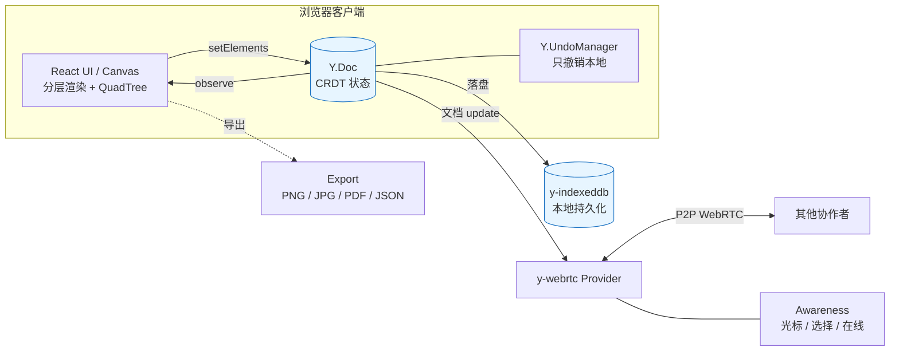

# mini-excalidraw

[](https://github.com/ZhechenZ/mini-excalidraw/actions/workflows/ci.yml)
[](https://github.com/ZhechenZ/mini-excalidraw/actions/workflows/deploy.yml)
[](https://opensource.org/licenses/MIT)
[](https://ZhechenZ.github.io/mini-excalidraw/)
[](#技术栈)

> 从零手写的 Excalidraw 精简版：一块 Canvas、一个 CRDT 文档、一条从"分层渲染 → 空间索引 → 本地持久化 → 实时协同"的完整工程主线。6 周迭代，每一周都是一个可独立讲清的技术专题。

**在线体验：** https://ZhechenZ.github.io/mini-excalidraw/ ｜ 点右上角「发起协同」生成房间，把链接发给同事即可多人同画。

---

## ✨ 特性（对应 6 周迭代）

- **分层 Canvas 渲染**（Week 1）：静态层 + 覆盖层分离，交互期间只重绘覆盖层；内建 FPS / 长任务性能埋点。
- **QuadTree 空间索引 + 视口裁剪**（Week 2）：点击命中、框选、渲染都先过四叉树缩小候选集，5k+ 元素依旧顺滑。
- **IndexedDB 持久化 + 多格式导出**（Week 3）：自动保存（节流落盘），一键导出 PNG / JPG / PDF / JSON。
- **Yjs CRDT 数据模型**（Week 4）：整张画布迁到 `Y.Doc`，`Y.UndoManager` 接管撤销重做，为协同打基座。
- **实时协同**（Week 5）：`y-webrtc` 免部署 P2P 同步 + Awareness 远端光标 / 选择框 / 在线用户列表，URL `#room=` 一键分享，支持只读模式。
- **工程化收尾**（Week 6）：Vitest 单测（覆盖率 ≥ 60%，实测 ~97%）、GitHub Actions CI/CD、渲染压测脚本、本 README 门面。

## 🚀 快速开始

```bash
pnpm install
pnpm dev          # 本地开发，默认 http://localhost:5173
pnpm build        # 生产构建（输出 dist/）
pnpm test         # 跑单元测试
pnpm test:ci      # 单测 + 覆盖率报告
pnpm bench        # 5000 元素渲染压测，输出 Markdown 表格
```

### 多人协同怎么玩

1. 打开应用，点右上角 **👥 发起协同**，会生成随机房间并复制邀请链接。
2. 把链接（形如 `.../#room=ab12cd34`）发给同事，对方打开即进入同一房间。
3. 想只读旁观？用 `.../#room=ab12cd34&mode=view` 打开即可（禁用本地编辑，仍能看到他人操作）。

> 协同截图 / GIF：_待补录 gif（发起房间 → 两个窗口远端光标跟随 → 同步绘制）_

## 🏗️ 架构总览



核心思想：**React 只负责订阅 `Y.Doc` 变更并渲染**；落盘交给 `y-indexeddb`，协同交给 `y-webrtc`，撤销交给 `Y.UndoManager`。三者共享同一个 `Y.Doc`，所以"加协同"这一步对业务层几乎零改动。

## 📊 性能数据

`pnpm bench` 压测「每帧重建 QuadTree 索引 + 视口裁剪」这条渲染前置路径（5000 元素 × 300 帧，Node 22）：

| 指标 | 数值 |
| - | - |
| 元素数量 | 5000 |
| 单帧平均耗时 | ~2.3 ms |
| P50 / P95 单帧耗时 | ~1.8 ms / ~3.3 ms |
| 折算 FPS 上限 | 60 |
| 长任务(>50ms) 帧数 | 0 |

> 数值随机器波动，以本地 `pnpm bench` 实测为准。含义：即便 5k 元素每帧重建索引，前置 CPU 开销也远低于 16.6ms 的一帧预算，绘制空间充足。

## 🧩 技术栈

React 19 · TypeScript · Vite · rough.js（手绘风渲染）· Yjs（CRDT）· y-indexeddb（持久化）· y-webrtc + y-protocols（协同 + Awareness）· Vitest（测试）· GitHub Actions（CI/CD）。

## 💼 简历 STAR 话术（6 条，逐周）

1. **分层渲染（Week 1）** — S：单层 Canvas 在拖拽时全量重绘导致掉帧。T：把绘制成本与交互解耦。A：拆分静态层 / 覆盖层，交互期间只重绘覆盖层并延迟 `setElements`，加入 FPS 与长任务埋点。R：拖拽 / 缩放路径的每帧重绘量大幅下降，交互稳定 60fps。
2. **空间索引（Week 2）** — S：命中测试与渲染对全部元素做线性扫描，元素上千即卡顿。T：把 O(n) 查询降到近似 O(log n)。A：实现 QuadTree，点击 / 框选 / 视口裁剪统一先查索引缩小候选集。R：5k+ 元素下点击命中与视口渲染依旧流畅（压测单帧前置开销 ~2ms）。
3. **持久化与导出（Week 3）** — S：刷新即丢失，且无法产出可分享的成果。T：本地不丢数据 + 多格式导出。A：封装极简 IndexedDB KV，节流自动保存；基于统一导出包围盒实现 PNG/JPG/PDF/JSON。R：断电级别的本地恢复能力 + 一键导出四种格式。
4. **CRDT 数据模型（Week 4）** — S：`useState` 数组无法支撑多端合并与"只撤销自己"。T：迁移到可协同的数据结构。A：整张画布建模为 `Y.Array<Y.Map>`，写入做按 id 增量 diff（零冗余 delta），撤销切到 `Y.UndoManager` 并用 `trackedOrigins` 只跟踪本地事务。R：Canvas 零改动完成数据层替换，撤销语义在协同下依然正确。
5. **实时协同（Week 5）** — S：需要多人同画但不想上后端。T：低成本落地实时协同 + 在场感。A：把同一个 `Y.Doc` 交给 `y-webrtc` 走 P2P，用 Awareness 广播光标 / 选中集，Canvas 顶层绘制远端光标与选择框，URL hash 做房间路由与只读分享。R：零后端即可多人协同，业务层改动 <100 行。
6. **工程化 Capstone（Week 6）** — S：项目缺少可交付、可回归的工程完成度。T：补齐测试 / CI/CD / 性能可观测。A：Vitest 覆盖核心算法（索引 / 包围盒 / 导出 / CRDT diff / 房间路由 / 持久化），配 GitHub Actions typecheck+test+build 门禁与 Pages 自动部署，产出渲染压测脚本。R：覆盖率 ~97%，主干每次推送自动验证并部署上线。

## ⚠️ 已知局限 & BugBash 清单

- **Awareness 断线重连**：网络抖动后远端光标可能短暂残留（Awareness 30s 超时才清），重连后自愈；可加更积极的心跳与离线标记。
- **并发文本编辑**：文本目前以整段字符串存储，两人同时编辑同一文本框会整体覆盖而非字符级合并；细粒度协同需改用 `Y.Text`。
- **y-webrtc 房间规模**：全连接 P2P，成员越多连接数越多，实用上限约 10 人；更大规模应切 `y-websocket` + 中心服务器。
- **图像 / blob 未跨端同步**：当前仅同步矢量元素，导入的位图 blob 不随文档广播。
- **视口共享**：`appState`（scroll/zoom）也在共享文档里，多人可能相互带动视口；可改为每用户本地视口。
- **公共信令服务器**：默认 `wss://y-webrtc-eu.fly.dev` 仅供演示，可能不稳定 / 有隐私顾虑，生产应自建信令。

## 📁 目录结构（节选）

```text
src/
  collab/        # CRDT + 协同：sceneDoc / elementSync / useYSceneDoc / yUndoManager
                 #              provider(y-webrtc) / awareness
  components/
    canvas/      # Canvas 主交互 + TextEditor
    collab/      # RemoteCursors / PresenceBar / ShareButton
  element/       # 几何：bounds / hit / quadtree / spatialIndex / resize / rotate ...
  export/        # exportBounds / PNG / JPG / PDF / JSON
  persistence/   # IndexedDB KV + scene
  renderer/      # 分层渲染
  utils/         # viewport / roomId / bench / perf
scripts/
  bench-render.ts
.github/workflows/
  ci.yml  deploy.yml
```

## License

MIT