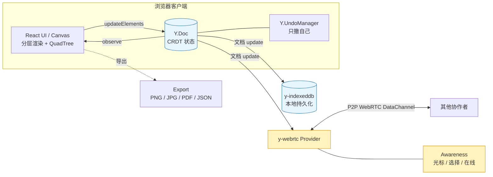

<div align="center">
  <h1 align="center">mini-excalidraw</h1>
  <p align="center">
    <strong>Local-first · CRDT-native Collaborative Whiteboard</strong>
  </p>
  <p align="center">
    从零手写的 Excalidraw 精简版。
    <br />
    一块 Canvas、一个 <code>Y.Doc</code>、一条从&nbsp;分层渲染&nbsp;→&nbsp;空间索引&nbsp;→&nbsp;本地持久化&nbsp;→&nbsp;实时协同&nbsp;的完整工程主线。
    <br />
    6 周迭代，每一周都是一个可以独立展开的技术专题。
  </p>
</div>

<p align="center">
  <a href="https://github.com/ZhechenZ/mini-excalidraw/actions/workflows/ci.yml"></a>
  <a href="https://github.com/ZhechenZ/mini-excalidraw/actions/workflows/deploy.yml"></a>
  
  
  
</p>

<p align="center">
  
  
  
  
  
  
</p>

<p align="center">
  <b>简体中文</b>
  ·
  <a href="./README.en.md">English</a>
</p>

<p align="center">
  <a href="https://ZhechenZ.github.io/mini-excalidraw/"><strong>🎨 在线体验 Live Demo →</strong></a>
</p>

<p align="center">
  <a href="#30-秒看懂">30 秒看懂</a>
  ·
  <a href="#项目叙事">项目叙事</a>
  ·
  <a href="#设计取舍">设计取舍</a>
  ·
  <a href="#快速开始">快速开始</a>
  ·
  <a href="#多人协同怎么玩">多人协同</a>
  ·
  <a href="#架构总览">架构</a>
  ·
  <a href="#技术亮点">技术亮点</a>
  ·
  <a href="#6-周迭代主线">6 周迭代</a>
  ·
  <a href="#性能数据">性能</a>
  ·
  <a href="#已知边界--bugbash">已知边界</a>
  ·
  <a href="#项目结构">项目结构</a>
</p>

---

## 30 秒看懂

mini-excalidraw 不是又一个 "clone 一遍 Excalidraw" 的教程项目。它是一份**能拆成六期讲、每一期都能单独展开成一个技术专题**的完整工程实践：

- 模型上，一整块画布状态**只用一个 `Y.Doc`** 承载，落盘、协同、撤销复用同一份数据源；
- 渲染上，静态层与覆盖层拆开、命中检测走四叉树，5k+ 元素依旧稳定在 60fps；
- 数据上，`y-indexeddb` 断电级本地恢复、`y-webrtc` 零后端 P2P 协同、`Y.UndoManager` 只撤销自己；
- 工程上，Vitest 覆盖率 ~97%、GitHub Actions CI 门禁 + main 自动部署 GitHub Pages。

```bash
git clone https://github.com/ZhechenZ/mini-excalidraw.git
cd mini-excalidraw && pnpm install
pnpm dev            # 本地打开 http://localhost:5173
```

| 你会看到什么 | 项目怎么做到 |
| --- | --- |
| 一块能画、能拖、能撤销的白板 | 分层 Canvas + rough.js 手绘风，交互期间只重绘覆盖层 |
| 5k 元素仍然顺滑的命中 / 框选 | QuadTree 空间索引 + 视口裁剪，先缩小候选集再计算 |
| 关标签页再打开还在 | `y-indexeddb` 把 `Y.Doc` 增量落盘，页面初始化秒级 hydrate |
| 一键 PNG / JPG / PDF / JSON 导出 | 统一 export bounds → 离屏 canvas → 各格式转码 |
| 撤销只回退自己、不动别人 | `Y.UndoManager` 用固定 `trackedOrigins` 过滤本地事务 |
| URL 一贴就能多人同画 | `y-webrtc` P2P + Awareness 广播光标 / 选择 / 在线列表 |

## 项目叙事

Excalidraw 是一个非常"漂亮"的开源项目，但读它的源码时你会发现：真正让它能跑起来的，从来不是那种一眼就能讲完的 trick，而是一层一层堆起来的工程决策：

- 为什么 Canvas 要拆两层？
- 元素多了为什么不能每帧 O(n) 命中？
- 为什么撤销要挂到数据层而不是 UI history stack？
- 为什么把 state 交给 CRDT 之后，加协同这一步反而是最轻的？

真实的答案，往往不是"因为原理是这样"，而是 **"因为不这么做，掉帧 / 抖动 / 撤销失效 / 加协同得改 300 处业务代码"**。

这个项目的写法是反过来的 —— **先给自己出一遍这些工程难题，再一层一层把答案落下来**：

1. 先做**分层渲染**，逼自己把「静态元素的绘制」和「交互期间的临时形态」拆开；
2. 再做**空间索引**，把命中和渲染从 O(n) 逼到近似 O(log n)；
3. 再做**持久化 + 多格式导出**，逼自己想清楚"数据形态"和"呈现形态"的边界；
4. 再做 **CRDT 数据模型**，逼自己把 `useState<Element[]>` 换成 `Y.Array<Y.Map>`，同时保证渲染层零改动；
5. 再接**实时协同**，回过头去印证前一步的抽象 —— 只多写不到 100 行；
6. 最后收尾**测试 · CI/CD · 性能可观测**，让整个项目从"能跑"变成"可交付"。

每一周的产出都对应一份可独立复述的技术专题（详见 [6 周迭代主线](#6-周迭代主线)）。

## 设计取舍

它不是一个"想做什么就做什么"的沙盒 demo，几个关键取舍是刻意的：

| 取舍点 | 选择 | 理由 |
| --- | --- | --- |
| UI 库 | **纯 Canvas + 少量 DOM 浮层** | 直面渲染性能，而不是靠框架托管 |
| 状态管理 | **`Y.Doc` 作为单一事实来源** | 让持久化 / 协同 / 撤销共享同一份数据源 |
| 后端 | **零后端**（`y-webrtc` P2P + 公共信令） | 演示可秒开，部署零成本 |
| 撤销 | **`Y.UndoManager` + `trackedOrigins`** | 天然支持协同下"只撤自己" |
| 打包 | Vite + GitHub Pages | 一次 push 自动上线，仓库链接始终指向可用产物 |
| 工程完成度 | Vitest / CI / bench / 门面 README 一并交付 | 让"能跑"变成"可交付、可回归" |

一句话总结：**尽可能压缩后端与外部依赖，把复杂度压到前端本地这一层来解决，好处是可读、可复现、可持续演化**。

## 快速开始

### 环境

- Node ≥ 20
- pnpm ≥ 9

### 一键起步

```bash
git clone https://github.com/ZhechenZ/mini-excalidraw.git
cd mini-excalidraw
pnpm install
```

### 常用命令

| 场景 | 命令 | 说明 |
| --- | --- | --- |
| 本地开发 | `pnpm dev` | Vite dev server，默认 http://localhost:5173 |
| 生产构建 | `pnpm build` | 输出 `dist/`，可直接部署静态托管 |
| 本地预览构建产物 | `pnpm preview` | 起一个静态 server 打开构建结果 |
| 单元测试 | `pnpm test` | Vitest watch 模式 |
| 单元测试 + 覆盖率 | `pnpm test:ci` | 一次性跑完并生成 coverage 报告 |
| 类型检查 | `pnpm typecheck` | 等价于 `tsc -b` |
| 渲染压测 | `pnpm bench` | 5000 元素 × 300 帧，输出 Markdown 表格 |

### 验证一切就绪

```bash
pnpm typecheck && pnpm test:ci && pnpm build
```

三条命令都退出码 0，说明代码、测试、构建三件事都跑通了。

## 多人协同怎么玩

协同这一层不需要你部署任何后端。信令走 y-webrtc 内置的公共 STUN，数据面走 WebRTC DataChannel P2P。

1. 打开在线 Demo 或本地 `pnpm dev`。
2. 点右上角 **👥 发起协同**，会生成随机 4~6 位房间号并把邀请链接复制到剪贴板。
3. 把链接发给同事（形如 `.../#room=ab12cd34`），对方浏览器打开即进入同一房间。
4. 想旁观？加 `&mode=view`：`.../#room=ab12cd34&mode=view`，禁用本地编辑，仍可看到远端光标 / 选择 / 绘制。

你会在协同过程中看到：

- 每个人一个专属颜色的光标（带用户名 tooltip），
- 每个人正在选中的元素外面套一圈同色虚线框，
- 右上角一个胶囊状"在线 N"，列出所有房间成员。

> ⚠️ 默认的 y-webrtc 公共信令服务器仅供 Demo 使用，可能不稳定；生产使用应换成自建 [y-websocket](https://github.com/yjs/y-websocket) 或自建 y-webrtc 信令。

## 架构总览



一句话总结整个系统：

> **React 只订阅 `Y.Doc` 变更并渲染；落盘、协同、撤销全都挂在 `Y.Doc` 上。**

也就是说：

- 加一个 **IndexedDB 持久化**，不需要动业务层 —— 挂一个 `IndexeddbPersistence(doc)` 就够了；
- 加一个 **实时协同**，不需要动业务层 —— 挂一个 `WebrtcProvider(doc)` 就够了；
- 加 **撤销 / 重做**，不需要写 history stack —— 挂一个 `Y.UndoManager(yElements, { trackedOrigins })` 就够了；
- **换后端**（webrtc → websocket），业务层零改动。

这套抽象是这个项目里最贵的一层设计。它意味着 **"加一个能力"的成本从"改 N 处业务"变成"多插一个 provider"**。

## 技术亮点

按层级归类，每一条都可以在代码里找到具体落点。

### 🏛️ 架构层

- **单一事实源架构（Single Source of Truth）**  
  整张画布只挂在一个 `Y.Doc` 上；React 只做 "订阅 + 渲染"，`y-indexeddb` / `y-webrtc` / `Y.UndoManager` 都是**同一份数据源上的插件**。加一个能力 = 挂一个 provider，业务层零改动。
- **分层 Canvas 渲染管线**  
  静态层承载"最终形态"，覆盖层承载"交互期间的临时形态"。move / resize / rotate **交互期间不触发 `setElements`**，只更新 `interactionRef`，pointerup 时才提交，避免中间态污染撤销栈。
- **统一 `exportBounds` 抽象**  
  PNG / JPG / PDF / JSON 四种导出**共享同一份包围盒计算**，格式差异被压到最后一步的转码器；新增一种导出格式只是"再实现一个 encoder"。
- **URL 作为唯一事实源**  
  房间号（`#room=xxxx`）、只读模式（`&mode=view`）都写在 URL hash 上。分享链接 = 完整状态快照，无需数据库，无需登录。

### 🔬 算法层

- **QuadTree 空间索引**  
  自研四叉树 + 统一入口 `queryViewport(bounds)`。点击命中、框选、视口裁剪三条路径复用同一份索引，5k+ 元素单帧前置开销压到 ~2ms。
- **按 id 增量 diff 的 CRDT 写入**  
  React state 每次变化时，`elementSync` 只把**变化的字段**塞进 `Y.Map`，零冗余 delta。协同带宽 = 变更本身，而不是"整张画布重发一遍"。
- **`trackedOrigins` 撤销分区**  
  `Y.UndoManager` 仅跟踪 `LOCAL_ORIGIN`，hydrate / migrate / 远端同步走独立 origin。天然满足协同下"只撤自己不撤别人"、"初次加载不进撤销栈"。
- **rAF-batched 渲染**  
  Yjs observer 触发后不立即 setState，走 `requestAnimationFrame` 合并；一帧内多次 CRDT 变更（本地绘制 + 远端广播 + IndexedDB 回放）只重绘一次。

### 🌐 协同层

- **零后端 P2P 实时同步**  
  `y-webrtc` 走 WebRTC DataChannel，同房间浏览器之间**直接连**。信令走 y-webrtc 内置公共 STUN，用户侧无部署成本；生产可换 `y-websocket` 自建。
- **Awareness 状态广播**  
  每个 peer 广播光标位置、选中集、用户名、颜色。Canvas 顶层用 DOM/SVG（而非再开一层 canvas）绘制远端光标 + 虚线选择框；DOM 定位更适合小规模 (~10) 高频移动对象。
- **右上角 PresenceBar**  
  实时展示"当前房间在线 N 人"，头像颜色与光标 / 选择框同色，"这个光标 = 这个人"在视觉上自然闭环。
- **只读旁观模式**  
  URL 加 `&mode=view` 即禁用本地事务，仍能实时看到别人操作。用于分享观摩 / 屏幕背景板。

### ⚙️ 工程层

- **Vitest 单测覆盖率 ~97%**  
  用 `fake-indexeddb` + `jsdom` 在 Node 环境里跑 IndexedDB / DOM 测试，覆盖 QuadTree / bounds / export / elementSync / roomId / persistence 全部核心算法；40 用例全绿，Statements 97%、Functions 100%。
- **GitHub Actions 双 workflow**  
  `ci.yml` 在 PR 上跑 typecheck + test + build 作为门禁；`deploy.yml` 在 main 合并后自动构建并推 GitHub Pages。**推一次 push → 上线 / 挂掉**，正反馈闭环。
- **`bench-render.ts` 性能基线**  
  5000 元素 × 300 帧压测"每帧重建 QuadTree + 视口裁剪"这条渲染前置路径，输出 avg / P50 / P95 / long task 的 Markdown 表格，每次改动都可复现，性能有基线可回归。
- **StrictMode 单例陷阱经验**  
  Yjs `Doc` / `UndoManager` 是**组件生命周期的单例**，绝不能在 `useEffect` cleanup 里 destroy —— React.StrictMode 的双挂载会让第二次 mount 复用"已销毁"的 Doc，导致 Ctrl+Z 静默失效。这个坑在 Week 4 撞过一次，最终定位到 `useYSceneDoc` 的 cleanup 里错误调用了 `doc.destroy()`，删除后即恢复。修复方案沉淀在 `src/collab/useYSceneDoc.ts` 的注释里。

### 💎 交互 / 体验细节

- **rough.js 手绘风渲染**  
  所有基础图形（矩形 / 椭圆 / 箭头 / 手绘线）都过 rough.js 一遍，得到"故意抖动的线条"，观感更接近白板草图，也是 Excalidraw 的标志性风格。
- **双击直接进入文本二次编辑**  
  用 React `onDoubleClick` 而非 `pointerdown` 的 `e.detail === 2` 兜底，避免长按 / 短抖误触；输入期间放行全局 keydown 的 INPUT/TEXTAREA/contentEditable，杜绝"打字打不上去"。
- **500ms debounce autosave + beforeunload 兜底**  
  绝大多数场景用节流写盘避免抖动，关标签页那一下用 `beforeunload` 强制 flush，做到"意外关闭不丢数据"。
- **一键复制邀请链接**  
  优先 `navigator.clipboard.writeText`，非 HTTPS 环境自动降级到临时 textarea + `execCommand('copy')`，兼容 file:// 与内网环境。复制成功后按钮 2s 内变绿反馈。

## 6 周迭代主线

每一周产出一份独立的技术专题（设计动机、完整覆盖代码、演进方向）。

| 周次 | 主题 | 关键技术 | 交付 |
| :-: | --- | --- | --- |
| Week 1 | 分层 Canvas + 性能埋点 | 双层 Canvas · rAF · FPS / Long Task | 交互期间只重绘覆盖层，掉帧从"随手可复现"降到"日常无感" |
| Week 2 | 空间索引 + 视口裁剪 | QuadTree · viewport bounds | 命中 / 框选 / 渲染统一先过索引，5k+ 元素依旧顺滑 |
| Week 3 | 本地持久化 + 多格式导出 | IndexedDB · debounce autosave · jsPDF | 断电级本地恢复 + PNG / JPG / PDF / JSON 一键导出 |
| Week 4 | CRDT 数据模型 | Yjs · `Y.Array<Y.Map>` · `Y.UndoManager` | React 层零改动完成"数组 → CRDT"，撤销天然协同友好 |
| Week 5 | 实时协同 | y-webrtc · Awareness · URL hash 路由 | 零后端 P2P 同步 + 远端光标 / 选择 / 在线列表 + 只读分享 |
| Week 6 | 工程化收尾 | Vitest · GitHub Actions · bench 脚本 | 覆盖率 ~97%、CI 门禁、Pages 自动部署、渲染压测量化 |

<details>
<summary><strong>Week 1 · 分层 Canvas + 性能埋点</strong>（点击展开）</summary>

**问题**：单层 Canvas 拖拽时全量重绘导致掉帧。

**方案**：拆两层 —— 静态层 `staticCanvas` 承载"最终形态"，覆盖层 `overlayCanvas` 承载"交互期间的临时状态"。move / resize / rotate 交互期间**不调用 `setElements`**，只更新 `interactionRef` 中的临时偏移，pointerup 时才提交。加 FPS / Long Task 埋点作为性能回归线。

**结果**：拖拽 / 缩放路径每帧重绘量骤降，交互稳定 60fps。
</details>

<details>
<summary><strong>Week 2 · QuadTree 空间索引 + 视口裁剪</strong></summary>

**问题**：命中 / 框选 / 渲染都在对全量元素做线性扫描，元素上千即卡顿。

**方案**：实现 QuadTree，抽出统一入口 `queryViewport(bounds)`。点击命中、框选、静态层渲染统一先走索引缩小候选集。视口裁剪 = "找和当前 viewport rect 相交的候选"。

**结果**：5k+ 元素下点击命中、视口渲染依旧流畅；压测下单帧前置开销 ~2ms（详见 [性能数据](#性能数据)）。
</details>

<details>
<summary><strong>Week 3 · IndexedDB 持久化 + 多格式导出</strong></summary>

**问题**：刷新即丢，且无法产出可分享的成果物。

**方案**：封装极简 IndexedDB KV，`useAutosave` 500ms debounce 落盘 + `beforeunload` 兜底。基于统一 `exportBounds` 打通 PNG / JPG / PDF / JSON 四种格式：矢量 → 离屏 canvas → `toBlob` / `jspdf.addImage()` / 结构化 JSON。

**结果**：断电级恢复能力 + 一键四种格式导出。
</details>

<details>
<summary><strong>Week 4 · Yjs CRDT 数据模型</strong></summary>

**问题**：`useState<Element[]>` 不支持多端合并，撤销做在 UI 层也无法在协同下正确工作。

**方案**：整张画布建模为 `Y.Array<Y.Map>`，写入按 id 做增量 diff（零冗余 delta），撤销切到 `Y.UndoManager`，用固定 `LOCAL_ORIGIN` 作为 `trackedOrigins` 只跟踪本地事务，迁移 / hydrate 写入走独立 origin 避免误进撤销栈。

**结果**：React 层零改动完成"数组 → CRDT"，撤销语义在协同下依然正确。
</details>

<details>
<summary><strong>Week 5 · 实时协同</strong></summary>

**问题**：想多人同画，但不想开一个后端服务。

**方案**：同一个 `Y.Doc` 交给 `y-webrtc` 走 P2P；用 Awareness 广播光标 / 选中集 / 用户信息，Canvas 顶层用 DOM/SVG 绘制远端光标与选择框；URL hash 承载房间号 + 只读模式，是唯一事实来源。

**结果**：零后端即可多人协同，业务层改动 <100 行。
</details>

<details>
<summary><strong>Week 6 · 工程化收尾 & Capstone</strong></summary>

**问题**：项目缺少可交付、可回归的工程完成度。

**方案**：Vitest 覆盖核心算法（quadtree / bounds / export / elementSync / roomId / persistence）；GitHub Actions 双 workflow —— CI（typecheck + test + build）做门禁，Deploy 主干合并后自动发 GitHub Pages；`scripts/bench-render.ts` 生成 5k 元素场景做单帧耗时统计。

**结果**：覆盖率 ~97%、主干每次推送自动验证并部署上线，性能有基线可回归。
</details>

## 性能数据

`pnpm bench` 压测「每帧重建 QuadTree 索引 + 视口裁剪」这条渲染前置路径（5000 元素 × 300 帧，Node 22，M 系列笔记本）：

| 指标 | 数值 |
| --- | --- |
| 元素数量 | 5000 |
| 单帧平均耗时 | ~2.3 ms |
| P50 / P95 单帧耗时 | ~1.8 ms / ~3.3 ms |
| 折算 FPS 上限 | 60 |
| 长任务（>50ms）帧数 | 0 |

> 数值随机器波动，以本地 `pnpm bench` 实测为准。含义：即便 5k 元素每帧重建索引，前置 CPU 开销也远低于 16.6ms 一帧预算，浏览器还有 ~14ms 空间给绘制、合成、GC。

## 已知边界 & BugBash

诚实一点，说清楚它 **不是什么**、以及 **还差什么**：

- **Awareness 断线重连**：网络抖动后远端光标可能短暂残留（Awareness 30s 超时才清），重连后自愈；可加更积极的心跳与离线标记。
- **并发文本编辑**：文本目前以整段字符串存储，两人同时编辑同一文本框会整体覆盖而非字符级合并。若要真·字符级合并需改用 `Y.Text`。
- **y-webrtc 房间规模**：全连接 P2P，成员越多连接数越多，实用上限约 10 人。更大规模需切 `y-websocket` + 中心服务器。
- **图像 / blob 未跨端同步**：当前仅同步矢量元素，导入的位图 blob 不随文档广播。
- **视口共享**：`appState`（scroll / zoom）也在共享文档里，多人可能相互带动视口；改为每用户本地视口是一次简单迭代。
- **公共信令服务器**：默认 `wss://y-webrtc-eu.fly.dev` 仅供演示，可能不稳定 / 有隐私顾虑，生产应自建信令。
- **移动端 / 触屏**：目前只在 pointer 事件上做了基础适配，触屏手势（双指缩放、旋转）尚未打磨。

## 项目结构

```text
mini-excalidraw/
├── .github/workflows/       # CI (typecheck + test + build) & Pages 自动部署
├── scripts/
│   └── bench-render.ts      # 5000 元素 × 300 帧渲染前置耗时压测
├── src/
│   ├── collab/              # CRDT + 协同：
│   │                        #   sceneDoc / elementSync / useYSceneDoc
│   │                        #   yUndoManager / provider (y-webrtc) / awareness
│   ├── components/
│   │   ├── canvas/          # Canvas 主交互 + TextEditor
│   │   ├── collab/          # RemoteCursors / PresenceBar / ShareButton
│   │   ├── menu/            # AppMenu（保存 / 导出 / 分享）
│   │   └── dev/             # FpsMeter 等开发浮层
│   ├── element/             # 几何：bounds / hit / quadtree / spatialIndex
│   │                        #        resize / rotate / types ...
│   ├── export/              # exportBounds → PNG / JPG / PDF / JSON
│   ├── persistence/         # IndexedDB KV + scene + useAutosave
│   ├── renderer/            # 分层渲染 renderScene
│   ├── state/               # AppState / History
│   ├── utils/               # viewport / perf / bench / roomId
│   ├── App.tsx              # 组装所有子系统
│   └── main.tsx
├── vite.config.ts
├── vitest.config.ts
├── tsconfig.json
└── package.json
```

## 技术栈

Rendering · **React 19 + Vite + rough.js**  
State · **Yjs（CRDT）**  
Persistence · **y-indexeddb**  
Collaboration · **y-webrtc + y-protocols（Awareness）**  
Export · **HTMLCanvasElement `toBlob` + jsPDF**  
Testing · **Vitest（jsdom + fake-indexeddb）**  
CI / CD · **GitHub Actions + GitHub Pages**  
Language · **TypeScript（strict）**

## Roadmap

- [ ] 触屏手势（pinch-zoom / two-finger pan）
- [ ] 字符级协同文本（`Y.Text`）
- [ ] 位图 / SVG 元素跨端同步
- [ ] 视口本地化（不再跟随他人 scroll / zoom）
- [ ] `y-websocket` 自建信令 + 服务端持久化
- [ ] 移动端 UI 打磨（工具栏折叠 + 触觉反馈）

## License

[MIT](./LICENSE) © [ZhechenZ](https://github.com/ZhechenZ)

---

<p align="center">
  欢迎在 issue 里聊聊你会怎么改 —— 代码 reviewer 视角、原生 Excalidraw 用户视角、Yjs 从业者视角，都欢迎。
</p>